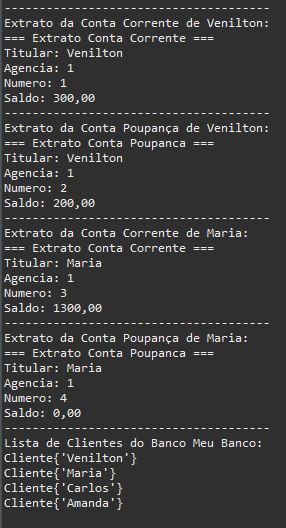

# Sistema Bancário

&nbsp;
 Atividade proposta pela DIO em parceria com Santander, que consiste desenvolver um sistema bancário em Java.

 Com esse sistema é possivel criar novos usuários, com contas corrente e/ou poupança.
 Simular depósito, saque e transferências.
 Exibir lista com nome de todos clientes do banco.
 

 
&nbsp;

## Renata Ribeiro

  

  

  

  
